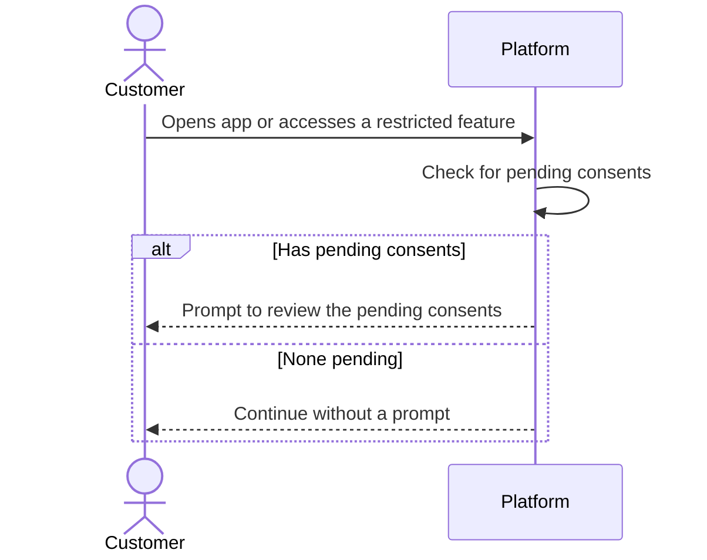

# Example: Consent Management

Complete example showing all Linear levels.

---

## Initiative

**Name:** Platform Compliance

**Short Summary:** `GDPR/PDPA readiness for EU and Thailand market expansion`

**Description:**
```markdown
## Why

Expanding to EU and Thailand markets requires regulatory compliance. 
Without GDPR/PDPA readiness, we face fines up to 4% of global revenue 
and cannot legally operate in these regions.

## Target Outcome

Platform is audit-ready for GDPR and PDPA by end of Q1 2026.
```

---

## Project

**Name:** Consent Management

**Short Summary:** `Backend service for managing and collecting customer consents`

**Description:**
```markdown
## TL;DR

- **Problem:** Platform lacks consent management for GDPR/PDPA, risking fines and audit failures
- **Solution:** Backend consent service with customer APIs and audit-ready data model
- **Impact:** Regulatory compliance and audit readiness for EU/Thailand markets

## Scope

**In:**
- Customer APIs: grant, withdraw, query consent
- Audit-ready consent records with metadata
- Admin management via backend dashboard
- Multi-tenant data isolation
- Consent versioning with re-consent triggers

**Out:**
- Consent UX/UI (client app responsibility)
- Cookie banner implementation
- Data deletion / "right to be forgotten"
- Consent analytics dashboards

## Decisions Needed

None — ready for implementation

## Technical Considerations

- **Constraint:** Must integrate with existing multi-tenant architecture
- **Constraint:** Must integrate with existing customer authentication
- **Compliance:** Consent records must be immutable (no hard deletes)
- **Compliance:** Must capture: timestamp, IP, user agent, collection method, policy version
- **Question:** Should pending consent checks support ETag caching?
```

---

## Milestones

1. Admin Management
2. Customer Actions
3. Customer Visibility

---

## Project Document

**Title:** `Spec: Customer Actions`

````markdown
# Spec: Customer Actions

## Overview

Customers can grant and withdraw consent through client applications. 
The system captures comprehensive metadata for GDPR/PDPA audit compliance. 
This is backend-first — client apps handle the UX.

## User Stories

| ID | Story | Priority |
|----|-------|----------|
| US-001 | Customer can grant consent to a published version | Must-have |
| US-002 | Customer can withdraw consent | Must-have |
| US-003 | Customer can re-grant consent after withdrawal | Should-have |

## Business Rules

| ID | Rule | Rationale |
|----|------|-----------|
| BR-001 | Consent records are immutable once created | GDPR requires demonstrable consent at point in time |
| BR-002 | Only published versions can receive consent | Prevents consent to unapproved policy text |
| BR-003 | Re-consent creates new record, doesn't modify old | Maintains complete audit history |
| BR-004 | Withdrawal sets timestamp, doesn't delete | Audit trail must show when withdrawn |
| BR-005 | IP/user agent capture is best-effort | Null acceptable if unavailable |

## Data Requirements

| Data Element | Required | Format | Notes |
|--------------|----------|--------|-------|
| Customer identifier | Yes | Reference | Link to existing customer |
| Consent version identifier | Yes | Reference | Must be published version |
| Consented timestamp | Yes | Datetime | System-generated |
| Withdrawn timestamp | No | Datetime | Set on withdrawal |
| IP address | No | String | From request headers |
| User agent | No | String | From request headers |
| Collection method | Yes | Enum | signup_form, login_prompt, cookie_banner, settings_page |

### Entity Relationships (Conceptual)

```
Customer ──grants many──▶ Customer Consent Records
Consent Version ──receives many──▶ Customer Consent Records
```

## Edge Cases

| Scenario | Expected Behavior | Priority |
|----------|-------------------|----------|
| Customer grants consent twice for same version | Return existing record, no duplicate | Must-have |
| Customer attempts consent to archived version | Error: "Version no longer active" | Must-have |
| Customer attempts consent to draft version | Not found (drafts not exposed) | Must-have |
| Customer withdraws already-withdrawn consent | Error: "Already withdrawn" | Must-have |
| IP address unavailable | Store null, don't block | Should-have |

## Open Questions for Engineering

1. Should we implement ETag caching for pending consents endpoint?
2. How to handle race conditions if version archived mid-flow?
````

---

## Issues

> Each Issue Description below is wrapped in a 4-backtick fence so the nested visuals (ASCII, Mermaid) render. Across the three, the visuals demonstrate each placement: ASCII in Why (Issue 1), Mermaid in Acceptance Criteria (Issue 3), Figma in Resources (Issue 1). Issue 2 shows the "no visual" case.

### Issue 1

**Title:** `As a customer, I can grant consent to a published policy version so that I can use platform features`

**Description:**
````markdown
## Why

A customer must consent to the current policy before using features that depend on it. Capturing each consent cleanly keeps us audit-ready.

```
Before: customer blocked, nothing on record
After:  consent to v3 recorded, with the time, device, and network
```

## Acceptance Criteria

- A customer can grant consent to a published policy version
- Each consent is recorded with enough detail to audit it later: when it was given, and the device and network it came from where available
- The customer can indicate how the consent was collected (signup, login prompt, settings, cookie banner)
- Granting consent to the same version twice does not create a duplicate; the existing consent stands
- Consent cannot be given to an archived version; the customer is told it is no longer active
- A draft version is not available to consent to

## Technical Considerations

Consent records must be immutable for audit compliance.

## Resources

(Optional) Figma frame: [Consent prompt](https://www.figma.com/design/AbC123/Consent?node-id=10-20)
````

### Issue 2

**Title:** `As a customer, I can withdraw my consent so that my data is no longer processed under that policy`

**Description:**
````markdown
## Why

A customer can change their mind. Withdrawal must be honoured and provable later, so the record is kept rather than deleted.

## Acceptance Criteria

- A customer can withdraw a consent they previously gave
- The withdrawal is recorded with the time it happened; the original consent is never deleted (audit trail)
- Withdrawing an already-withdrawn consent tells the customer it is already withdrawn
- Withdrawing when no consent exists is reported as not found
````

### Issue 3

**Title:** `As a customer, when I have pending consents, I am prompted to review them so that I can continue using platform features`

**Description:**
````markdown
## Why

When a new policy version is published, customers need a clear nudge to act, without being nagged when nothing is pending.

## Acceptance Criteria

- A customer is shown the consents that still need their action
- A consent needs action when a published version exists that the customer has not consented to, including versions they previously withdrew from
- When nothing is pending, the customer continues without a prompt
- The prompt appears at natural moments, such as login or accessing a restricted feature



## Technical Considerations

Consider ETag caching for performance on the pending consents check.
````
